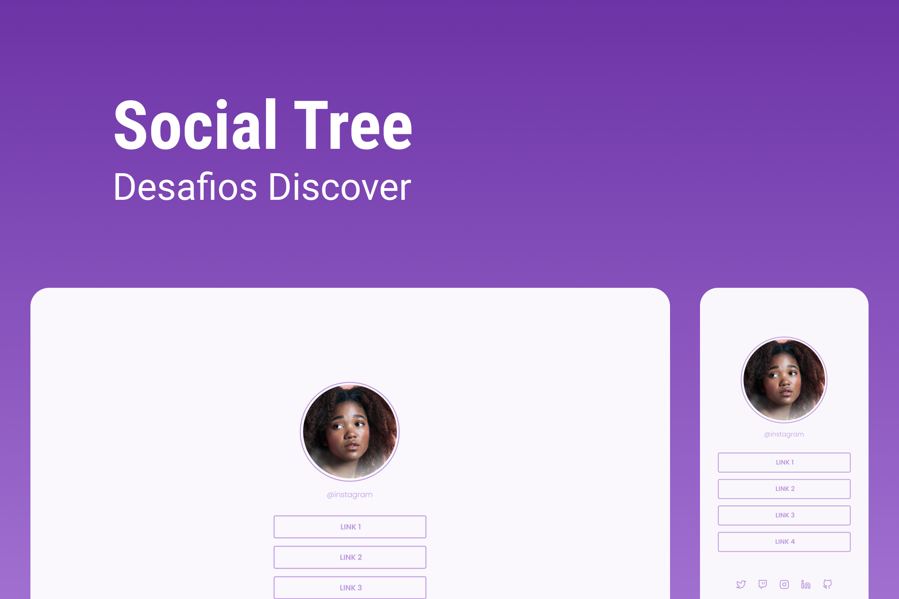

<h1 align="center">
  
</h1>

## Layout

Você pode duplicar o layout (figma) do projeto [clicando aqui](https://www.figma.com/file/yi1ycIyAW8QiGiX9bMFHkU/DD-%2F-Social-links/duplicate).

## **Requisitos:**

- Adicione uma imagem de perfil
- Adicione uma lista de links que pode ser usada para enviar o usuário para outros sites
- Opcional: Adicione ícones com links para outras redes sociais
- Você poderá usar como modelo o layout do Figma disponibilizado acima.

## 🎨 Style Guide

### **Cores:**

```css
:root {
  --body-bg-color: #faf7fd;
  --purple: #bb99dd;
}
```

### **Tipo de fonte:**

font-family: Poppins

Font Weight: 300 e 600

Você pode encontrar a fonte no [Google Fonts](https://fonts.google.com/)
